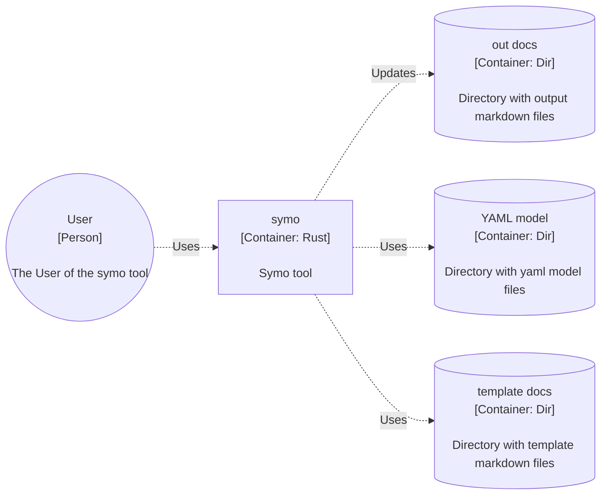

<!-- DO NOT EDIT; Autogenerated -->

# symo

Documentation tool for SYstem based on MOdel. Create model of system in yaml
declarative, prepare mardown docs & mermaid diagrams templates and render docs
with tool. Watch model & templates dir & recreate docs. Serve docs with simple
static http server.

## Future vision

Provide some analytics based on system model

## Usage

Build:
```
cargo build -r
```

help:
```
symo -h
```

One time run:
```
symo dir-with-models dir-with-docs-templates dir-output
```

Serve with watch:
```
symo dir-with-models dir-with-docs-templates dir-output -s
```

Serve with watch and listening addr:
```
symo dir-with-models dir-with-docs-templates dir-output -s -a localhost:8000
```

## Desing

The Concept of symo




## License

Licensed under either of

 * Apache License, Version 2.0, ([LICENSE-APACHE](LICENSE-APACHE) or http://www.apache.org/licenses/LICENSE-2.0)
 * MIT license ([LICENSE-MIT](LICENSE-MIT) or http://opensource.org/licenses/MIT)

at your option.
