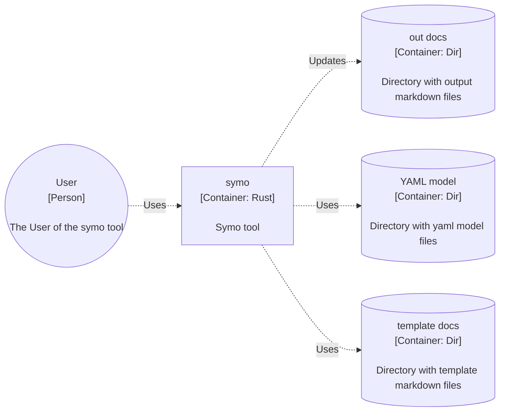

<!-- DO NOT EDIT; Autogenerated -->

# Desing of symo tool

The Concept of symo

```mermaid
flowchart LR
user
dir-model
dir-template
tool
dir-docs


dir-docs[("out docs<br/>[Container: Dir]<br/><br/>Directory with output markdown files")]
dir-model[("YAML model<br/>[Container: Dir]<br/><br/>Directory with yaml model files")]
dir-template[("template docs<br/>[Container: Dir]<br/><br/>Directory with template markdown files")]
tool["symo<br/>[Container: Rust]<br/><br/>Symo tool"]
tool -.->|"Updates"| dir-docs
tool -.->|"Uses"| dir-model
tool -.->|"Uses"| dir-template
user(("User<br/>[Person]<br/><br/>The User of the symo tool"))
user -.->|"Uses"| tool
```

